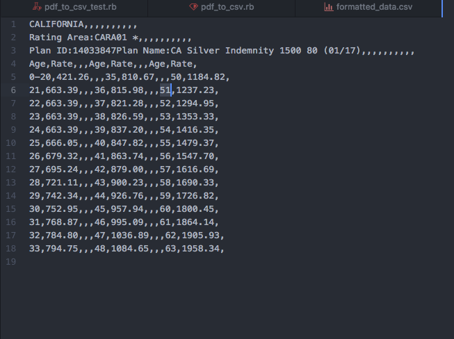
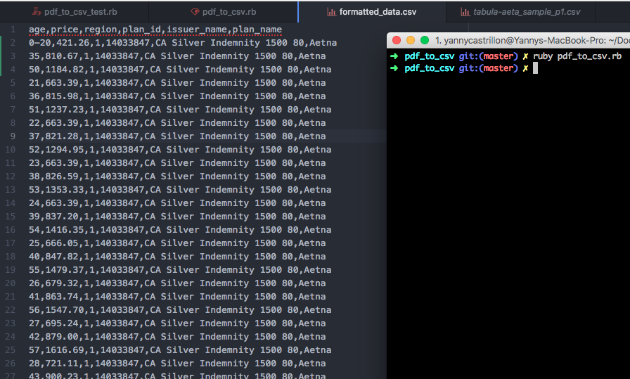
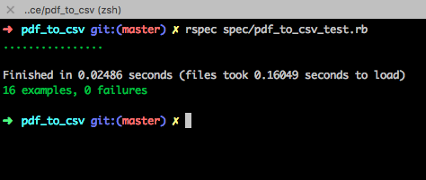

# PDF to CSV

Convert PDF of health plan pricing information to a standardized CSV format.
Use Tabula (http://tabula.technology/) to generate a non standard CSV format.

### Prerequisites

- Check Ruby's version:

```
ruby 2.3.1

```
- The name of the unformatted ``` .csv ``` file obtained by Tabula Technology:

```
tabula-aeta_sample_p1.csv
```



### Installing

1) Open the terminal and ```cd``` into project root directory.

2) To install all the necessary gems dependencies run:
```
bundle install
```

3) To execute the application run:
```
ruby pdf_to_csv.rb
```



## Running the tests

- Use TDD (Test Driven Development) approach.
- 16 examples to test main flow of the application.
- All methods are testable.

1) To execute all test run:
```
rspec spec/pdf_to_csv_test.rb
```



## Authors

* **Yanny Castrillon** - *My work* - [yannycastrillon](https://github.com/yannycastrillon)

## Github

* Managed Git and Github as a Control versioning system.
* Check the code's repository on: [Project Repository](https://github.com/yannycastrillon/pdf_to_csv)
## License

This project is licensed under the MIT License - see the [LICENSE.md](LICENSE.md) file for details
